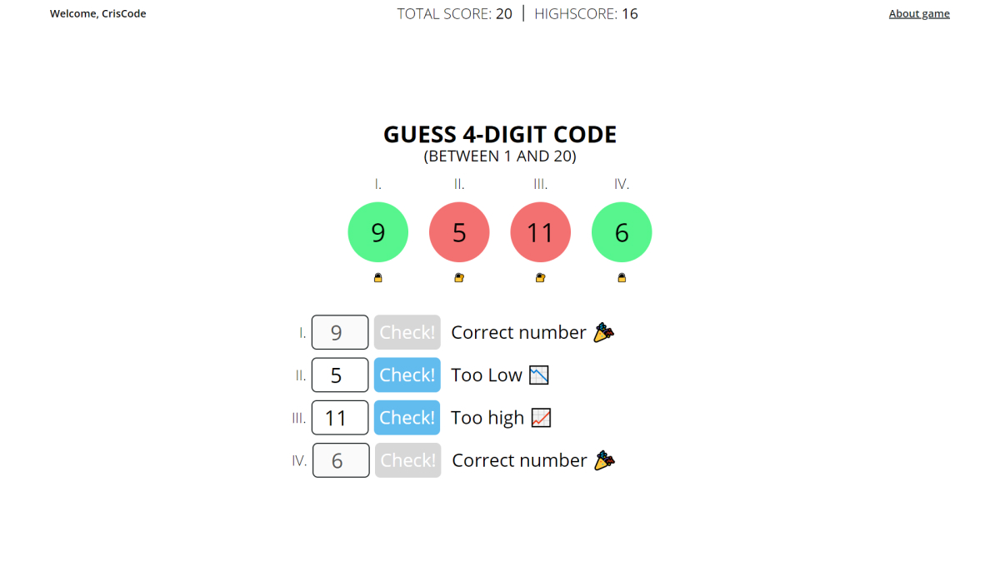

# GUESS 4-DIGIT CODE

## About project
A very simple game based on popular game GUESS NUMBER written in pure JS.

## Screenshot


## Demo version
Click here  -> [DEMO](https://guess-4-digit-code.netlify.app/)

## Setup on your local machine

  ### Clone project using GIT
  ```bash
  git clone https://github.com/KrzysztofGrudzien/guess-4-digit-code
  ```
  ### Install project to your computer
  ```bash
  npm install
  ```
  ### Start project in your local computer
  ```bash
  npm start
  ```
  ### Build production version
  ```bash
  npm run build
  ```
## Usage
For fun !!!

## Technologies Used
- JavaScript
- Webpack 4
- HTML5
- CSS
- SASS
- BEM Methodology

## Additional libraries
[canvas confetti](https://www.npmjs.com/package/canvas-confetti)

## Project status 
In progress

## Rules
1. Try to find out what number is hidden in the single input.
2. On the top of game, there is total score and highscore.
3. You can take MAX 20 points if you guess any number in the first time but if not the total score will be reduced depending how many click you do.
4. The best score will be displayed in the highscore table.
5. If you guessed all numbers, there is an animated surprise for you.
6. After that you will seen on the right a card with button - play again.
7. Have a fun very well.

## Video


## License
No license

## Contact
Created by [Krzysztof Grudzień](http://criscode.eu) - feel free to contact me!
